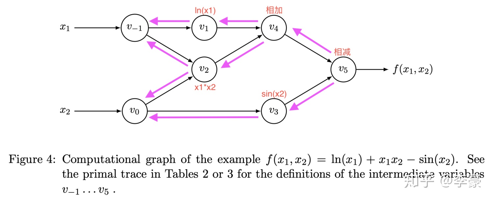
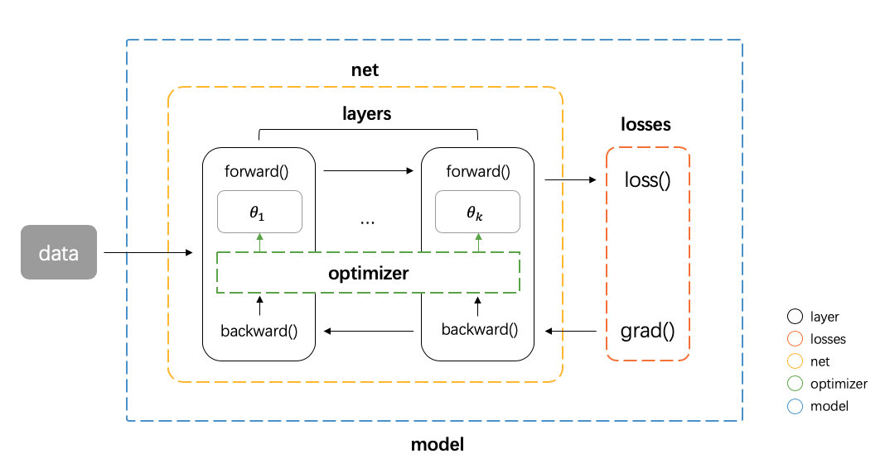
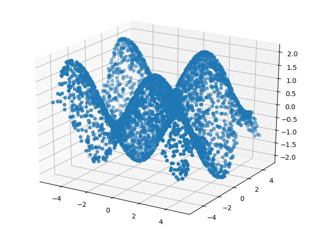
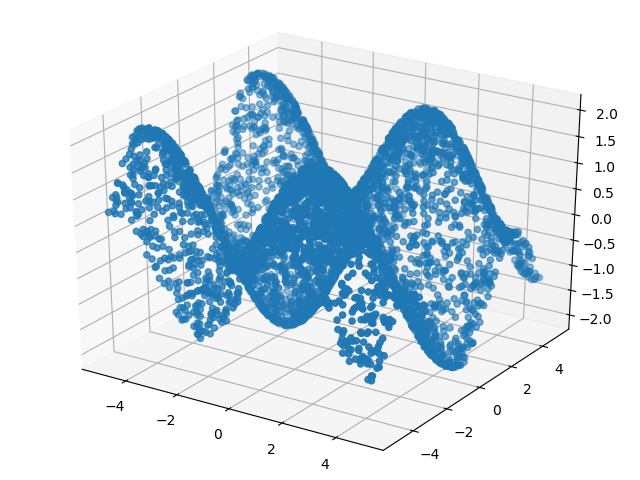
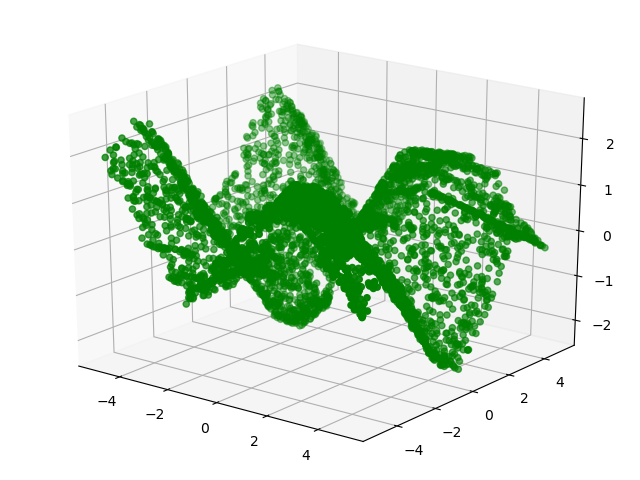
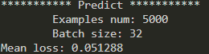
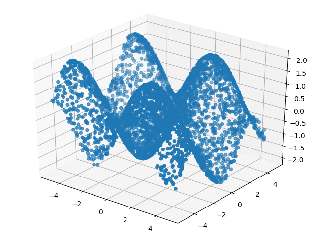

# 一个简单的深度学习框架
## 概述
* 本项目是在完成南京大学神经网络课程大作业1时建立的.
* 这次作业要求设计一个神经网络拟合函数, 
    $$y=\sin(x_1)-\cos(x_2), \qquad x_1, x_2\in[-5,5]$$
  且不允许使用现有的神经网络框架
* 基于以上原因, 参考网络上的资料实现了一个简单的深度学习框架, 此框架能够完成一些基本的深度学习任务
## 参考资料
* [joelgurs/autograd](https://github.com/joelgrus/autograd/tree/part06/autograd): 参考了此repo中关于tensor及其运算的实现
* * [*Automatic Differentiation Tutorial*](https://borgwang.github.io/dl/2019/09/15/autograd.html), 
  * [*Build a Deep Learning Framework From Scratch*](https://borgwang.github.io/dl/2019/08/18/tinynn.html)
  * 以及作者的repo [borgwang/tinynn-autograd](https://github.com/borgwang/tinynn-autograd). 参考了此repo中神经网络框架文件的组织结构 
* [*Python实现自动微分(Automatic Differentiation)*](https://zhuanlan.zhihu.com/p/161635270)
* [*啃一啃神经网络——权重初始化*](https://zhuanlan.zhihu.com/p/102708578)

## 文件及运行方式说明
### 环境
* Python 3.7
* 依赖的库请通过以下命令安装

        pip install -r requiremnets.txt
  建议使用`virtualenvwrapper`创建一个虚拟环境然后按照依赖的库
### 框架文件
框架文件放置在`mini_torch`路径下
* `tensor.py`: `Tensor`类及其重载的操作
* `layer.py`: 网络层
* `activation.py`: 激活函数 (激活层)
* `initializer.py`: 权重初始化器
* `network.py`: 网络
* `model.py`: 包含权重更新器, 网络, 损失函数的网络模型
* `optimizer.py`: 权重更新器
* `loss`: 损失函数
* `data_loader.py`: 数据加载器  

框架中方法的命名, 使用框架的方式模仿了 [Pytorch](https://pytorch.org/). 使用框架时请按需要`import`相关类或者函数

### 数据生成器
* `data_generator.py`: 生成训练, 测试数据. 可以设置数据数量, 文件导出位置等. 比如用以下命令生成5000条数据, 并按照4:1的比例划分训练集和测试集

      python data_generator.py --num 5000 --ratio 0.8
  用以下命令生成5000条测试数据

      python data_generator.py --num 5000 --test
  * 关于文件运行时参数的更多信息, 请参看代码文件

### 模型训练文件
* `fit_func.py`: 训练模型拟合函数并测试模型. 可以设置训练轮数, batch大小, 学习率等. 由于参数较多, 建议创建一个脚本来运行. 这里提供了一个脚本`run.sh`, 使用时只需在终端输入以下命令即可

      ./run.sh
  * 如果采用提供的脚本执行, 请首先将以上两条命令都执行一遍
  * 关于文件运行时参数的更多信息, 请参看代码文件
* `utils.py`: 包含用来绘图的函数

## 实现方法
### 框架的实现
* 自动求导:
  * 神经网络的BP算法的关键在于反向传播, 反向传播通过链式法则对每个参数进行求导, 而自动求导可以让我们在搭建好一个神经网络后, 不再需要手动指定求导过程. 
  * 自动求导的基础是计算图, 下图是 $f(x_1, x_2)=\ln(x_1)+x_1x_2-\sin(x_2)$的计算图  
        
    其中每个结点是中间计算的结果, 从左往右为正向计算函数, 从右往左为梯度方向传播的过程. 
  * 因此要实现自动求导, 就要在正向计算时记录下当前操作的导函数, 并把操作之间的依赖关系记录下来. 在求导时, 其实就是在计算图上用深度优先搜索 (DFS) 来传播梯度.
  * 而要在正向计算时记录下导函数以及依赖关系, 就需要一种新的数据类型来描述操作的结果, 这种数据类型就是`Tensor`类, 并且通过重载它的操作, 完成正向计算的同时完成计算图的构建.
* 框架组件
  * 实现了自动求导后, 就能在其基础上完成框架的搭建. 对于一个完整的神经网络模型, 如下图所示,   
        
  可以把它拆分成layer (包括activation), network, optimizer, loss function这几部分, 其中network由layer构成, 一个model由network, optimizer, loss function构成. 此外, 再针对权重的初始化实现initializer, 以及加载数据的data_loader, 那么一个非常基础的神经网络框架就搭建好了, 就可以调用框架来搭建神经网络

### 搭建神经网络拟合函数
* 设计方案
  * 采用了一个7层的神经网络, 每一层都是全连接层, 神经元数量分别为200, 100, 100, 80, 50, 30, 1. 
  * 隐藏层采用的激活函数是ReLU函数, 输出层不需要激活函数.
  * 训练轮数为300轮, batch大小为64, 学习率为3e-4
* 效果展示
  * 训练数据4000条, 测试数据1000条, 随机生成. 测试数据的作用是在训练过程中, 随训练过程动态可视化模型的拟合程度. 训练数据可视化后如下图所示  
       
  * 经过训练后, 在测试集上测试. 测试集本身的分布情况如下图所示  
          
    使用模型拟合出的效果如下图所示  
          
    可以直观看出, 该模型已经有较好的拟合能力, 平均误差如下图所示  
        
### 训练时可能遇到的问题及改进方法
* 在某几次实验时, 发现该模型在拟合[-2, 2]区间, 即位于图中中间部分的最小值点时, 效果不太好, 往往不能下降到最低点. 
* 此时一方面可以尝试增加隐藏层数, 增大每一层神经元数量, 另一方面可以从数据集下手. 经过分析发现训练数据生成时在这一区间上的样本量不足. 于是在`data_generator.py`中, 加入了一个新的参数`--extra_ratio`参数来控制额外生成的在该区间上的数据数量. 新的训练数据在4000条训练数据之外, 额外增加了500条位于此区间的数据, 可视化后如下图所示
      
  可以看出, 中间的最小值点附近的训练样本更多了. 这样可以在不改变网络结构的前提下提升拟合能力.